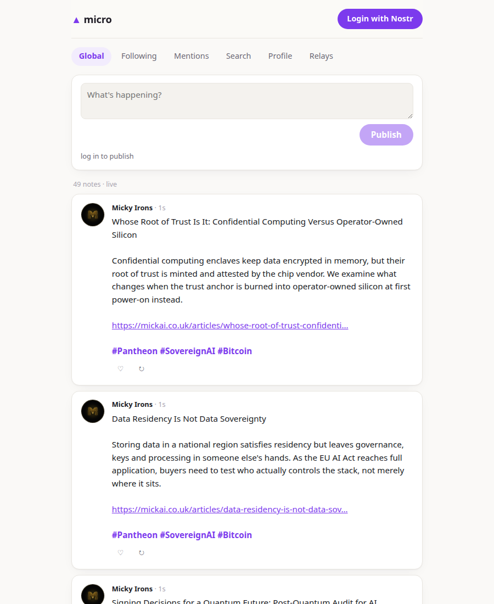

# micro

A microblogging nostr client — **composed entirely from independent
nostr-client components**. No build step, no bundler, no framework. This whole
client is one HTML file that imports web components from their own repos.

**Live:** https://nostr-client.github.io/micro/



```html
<script type="module">
  import 'https://nostr-client.github.io/login/login.js'
  import 'https://nostr-client.github.io/composer/composer.js'
  import 'https://nostr-client.github.io/feed/feed.js'
  import 'https://nostr-client.github.io/thread/thread.js'
  import 'https://nostr-client.github.io/reactions/reactions.js'
  import 'https://nostr-client.github.io/notifications/notifications.js'
  import 'https://nostr-client.github.io/contacts/contacts.js'
  import 'https://nostr-client.github.io/profile-editor/profile-editor.js'
  import 'https://nostr-client.github.io/relay-manager/relay-manager.js'
</script>

<nostr-login></nostr-login>
<nostr-composer></nostr-composer>
<nostr-feed limit="30"></nostr-feed>
<nostr-thread></nostr-thread>
<nostr-notifications></nostr-notifications>
<nostr-contacts></nostr-contacts>
<nostr-profile-editor></nostr-profile-editor>
<nostr-relay-manager></nostr-relay-manager>
```

Plus ~80 lines of glue: tabs, hash-routing into threads (`#<hex event id>` is
a shareable permalink), and the kind-3 contact list piped into
`<nostr-feed authors="…">`. Importing `reactions.js` is one line — every note
card grows like/repost buttons.

micro is the *daily* grade of the composed clients; its calmer sibling is
[zen](https://nostr-client.github.io/zen/), the read-only one.

## Why this exists

It's the proof of the [nostr-client](https://github.com/nostr-client) thesis:
if each part does one thing and speaks the shared contract (hex pubkeys,
NIP-07-shaped `window.nostrSigner`, `nostr:*` window events, one shared relay
pool), then *a client is just a page that arranges parts*.

Fork this repo, delete what you don't want, add parts you do — no toolchain to
set up. Swap any component for your own implementation by changing one URL.

## License

AGPL-3.0-or-later
